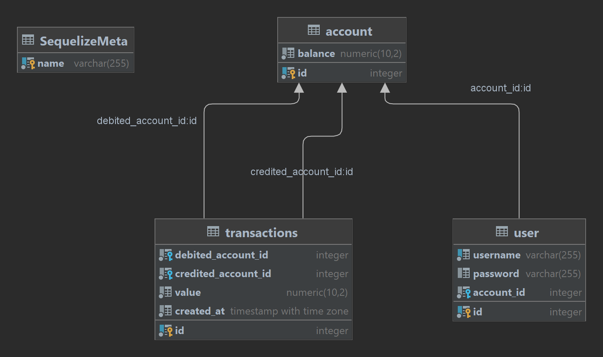

# NG Cash Project
Projeto teste no processo seletivo [NG Cash](https://ng.cash/seguranca)

> Este projeto consiste em uma aplicação web para simulação de transferencia entre usuario

## Lista de funcionalidades:
- Registar um usuário na aplicação
- Efetuar login com um usuário registrado
- Exibir Lista com todas as transações feitas por este usuário
- Filtrar a lista de transações por Tipo Transações de Cash In (Crédito) e Cash Out (Débito) e filtrar também pela data de criação 
- Executar uma transferência para outro usuário

## Construção:
O desenvolvimento dessa aplicação envolveu a criação de um 
- Banco de dados em Postgres 
- Um servidor Express
- Um frontend em ReactJs
Cada uma das partes desse sistema está rodando em containers docker, desta forma a execução desse projeto requer a instalação prévia do Docker e do Docker Compose
[Link](https://docs.docker.com/engine/install/)

## Como Executar:
Uma vez instalado o Docker, deve-se entrar na pasta root (contém o arquivo docker-compose.yml), em seguida deve-se executar o comando
```sh
docker compose up -d
# Em versoes prévias do docker compose executar docker-compose up -d
```
Desta forma a aplicação estará rodando, para verificar, basta executar verificar no navegador:
- O servidor estará rodando na porta 5433, portanto basta entrar em http://localhost:5433/api-docs e terá acesso a documentação swagger da aplicação
- O frontend estará rodando na porta 3001, portanto basta entrar em http://localhost:3001/ e você acessará a página de registro

## Detalhes de Implementação:
### Banco de Dados
O banco de dados segue a estrutura: 
<br/>

### Backend
A aplicação é feita com Express + Sequelize e utiliza typescript.
A aplicação segue uma arquitetura MVC, e possui rotas acessíveis via swagger para testes, mas você também poderá importar automaticamente as requisições para o seu insomnia para realizar os testes:

[](https://insomnia.rest/run/?label=NG%20CASH&uri=https%3A%2F%2Fraw.githubusercontent.com%2Fjenifergs%2Fng-cash%2Fmaster%2Fassets%2Finsomnia.json)

### Frontend
A aplicação é feita em ReactJs e Hooks e utiliza typescript, nela podemos navegar por 3 paginas diferentes:
- Registro: página onde pode-se registrar um usuário e então ser redirecionado para tela principal ou clicar no botão para Sign In e ir para tela de login
- Login: Página onde pode-se executar a autenticação do usuário, e então ser redirecionado para tela principal, ou clicar no botão de Registro para ser redirecionado para tela de Cadastro
- Home: Tela onde pode-se acompanhar o balanço atual da conta, efetuar o logout, executar transferencias e ver a lista de transações realizadas, além de poder aplicar os filtros na listagem de transação.
